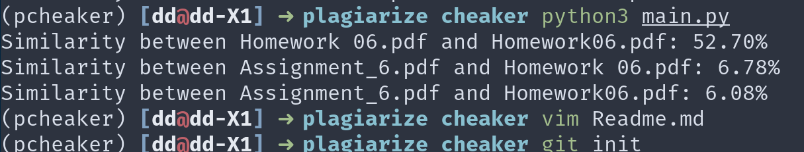

# Plagiarism Detection Tool

This tool is designed to automate the process of detecting plagiarism in student submissions. It extracts text from PDF files, filters out common questions, and compares documents to identify significant similarities.

## Features

- PDF text extraction using PyMuPDF.
- Sentence-level text filtering to exclude common questions or instructions.
- Document comparison to identify similarities based on configurable thresholds.
- Parallel processing for efficient handling of large numbers of documents.
- Creation of individual review folders for each student, containing the documents involved in plagiarism cases and a detailed report.

## Getting Started

### Requirements

- Python 3.x
- [PyMuPDF](https://pypi.org/project/PyMuPDF/)
- [spaCy](https://spacy.io/)
- [NLTK](https://www.nltk.org/)
- [tqdm](https://tqdm.github.io/)
- [python-docx](https://pypi.org/project/python-docx//)

Make sure to install the required Python packages using pip:

```bash
pip install PyMuPDF spacy nltk tqdm python-docx
python -m spacy download en_core_web_sm
python -m nltk.downloader punkt
```

### Installation

1. Clone this repository to your local machine.

```
git clone https://github.com/dongdongbh/plagiarize-cheaker.git
```

2. Navigate to the cloned repository directory.

3. Install the required Python libraries.


### Usage

The tool can be configured and run via the command line. Here are the available options:

`--question_path`: Path to the PDF file containing the homework questions. (default: ./data/questions/Homework6.pdf)

`--data_dir`: Directory containing student submissions. (default: ./data/hw6/)

`--cover_letter_path`: Path to the PDF file containing the cover letter. (default: ./data/questions/675cover.pdf)

`--min_block_size`: Minimum block size for considering a text match significant (only for notes). (default: 50)

`--question_filter_threshold`: Threshold for filtering out question sentences. (default: 0.7)

`--similarity_threshold`: Threshold for considering documents similar. (default: 0.15)

Example command:

```bash
python3 main.py --data_dir "./data/hw6/" --question_path "./data/questions/Homework6.pdf" --cover_letter_path "./data/questions/675cover.pdf"
```



## How It Works
1. **Preparation**: The script first removes any existing review folders in the specified data directory to start fresh.
2. **Text Extraction and Filtering**: For each PDF submission, the script extracts text, filters out sentences matching those in the provided question and cover letter documents, and then saves the filtered text for comparison.
3. **Comparison**: Documents are compared pairwise to calculate similarity scores. Cases where the similarity exceeds the configured threshold are flagged for review.
4. **Review Folders**: For each student involved in a flagged case, a folder is created containing their submission, the submissions they're compared with, and a CSV report detailing the comparisons.

## License

This project is licensed under the MIT License - see the [LICENSE](LICENSE) file for details.

## Acknowledgments

- This tool was inspired by the need to automate the plagiarism detection process in educational settings.
- Thanks to the contributors of PyMuPDF for providing a robust library for PDF processing.

