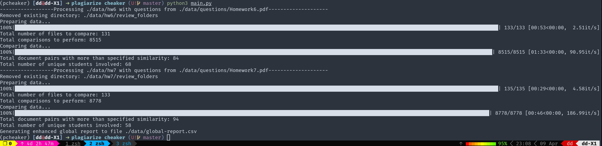

# Plagiarism Detection Tool

This tool is designed to automate the process of detecting plagiarism in student submissions across various assignments. It extracts text from both PDF and DOCX files, filters out common questions, and compares documents to identify significant similarities using configurable thresholds.

## Features

- Supports text extraction from PDF and DOCX file formats.
- Utilizes sentence-level text filtering to exclude common questions or instructions, enhancing the accuracy of plagiarism detection.
- Offers document comparison with configurable similarity thresholds, allowing for flexible and precise analysis.
- Employs parallel processing to efficiently handle large batches of documents.
- Generates detailed plagiarism reports, including global reports that summarize findings across all assignments.
- Facilitates review by creating symbolic links to original submissions instead of copying files, reducing disk space usage.
- Allows setting different similarity thresholds for different assignments via a JSON configuration file, accommodating varied analysis needs.

## Getting Started

### Requirements

- Python 3.x
- [PyMuPDF](https://pypi.org/project/PyMuPDF/)
- [spaCy](https://spacy.io/)
- [tqdm](https://tqdm.github.io/)
- [python-docx](https://pypi.org/project/python-docx/)

### Installation

1. Clone this repository to your local machine:

    ```bash
    git clone https://github.com/dongdongbh/plagiarize-cheaker.git
    ```

2. Navigate to the cloned repository directory and install the required Python libraries:

    ```bash
    pip install PyMuPDF spacy nltk tqdm python-docx
    python -m spacy download en_core_web_sm
    ```

### Configuration

1. Create a `config.json` file in the root directory with the following structure:

    ```json
    {
      "data_dir": "./data/",
      "min_block_size": 50,
      "question_filter_threshold": 0.7,
      "similarity_thresholds": {
        "HW1": 0.15,
        "HW2": 0.15
      }
    }
    ```

2. Modify the parameters as needed to fit your specific requirements.


## File Structure

Organize your files as follows to fit the script's expectations:
```
├── data
│   ├── global-report.csv
│   ├── students-list.csv
│   ├── hw1
|   |    |---submission-student1.pdf
|   |    |---submission-student2.pdf
|   |    |---review_folders
|   |    |    |    |---localreport.csv
|   |    |    |    |---submission-student1.pdf
|   |    |    |    |---submission-student2.pdf
|   |    |---global-report-hw1.csv
│   ├── hw2
│   ├── hw3
│   ├── hw4
│   ├── hw5
│   ├── hw6
│   ├── hw7
│   ├── hw8
│   ├── hw9
│   └── questions
│       ├── 675cover.pdf
│       ├── Homework1.pdf
│       ├── Homework2.pdf
│       ├── Homework3.pdf
│       ├── Homework4.pdf
│       ├── Homework5.pdf
│       ├── Homework6.pdf
│       ├── Homework7.pdf
│       ├── Homework8.pdf
│       └── Homework9.pdf
```
- **data/**: Main directory for student submissions and questions.
    - **questions/**: Contains the PDF files with homework questions and the cover letter.
        - `675cover.pdf`: The cover letter.
        - `Homework1.pdf`, `Homework2.pdf`, etc.: The homework questions.
    - **hw1/**, **hw2/**, etc.: Directories for each homework assignment, containing student submissions in PDF or DOCX format. Each directory should contain:
        - Student submissions (`.pdf` or `.docx`).
        - `global-report-hwX.csv` (X being the homework number): A generated report for the specific homework assignment.
        - **review_folders/**: Directory created by the script where each involved student in potential plagiarism cases has a folder with symbolic links to the involved documents and a detailed local report (`localreport.csv`).

## How It Works

1. **Configuration**: The script reads the provided `config.json` file to determine directories, thresholds, and other settings.
2. **Preparation**: Removes any existing review folders to start fresh.
3. **Text Extraction and Filtering**: Extracts text from submissions, filters out common sentences based on the questions and cover letter, and prepares the text for comparison.
4. **Comparison**: Calculates similarity scores between pairs of documents, flagging those that exceed the configured thresholds.
5. **Report Generation**: Creates detailed reports for individual cases within the `review_folders` directory and compiles a global report summarizing plagiarism findings across assignments in the `global-report.csv`.

## Usage Instructions

1. **Prepare your environment**: Ensure all dependencies are installed, and your Python environment is set up as described in the **Getting Started** section.
2. **Organize your files**: Arrange your student submissions and question documents according to the **File Structure** section.
3. **Configure the tool**: Adjust `config.json` to reflect your specific requirements for each homework assignment, including similarity thresholds and paths to question documents.
4. **Run the tool**: Execute the script with the path to your configuration file:

    ```bash
    python3 main.py --config_file "./config.json"
    ```



5. **Review the reports**: After processing, check the `global-report.csv` for an overview of potential plagiarism cases and inspect the `review_folders` for detailed comparisons.

## Customizing the Configuration

To modify how the plagiarism detection tool operates for different assignments, edit the `config.json` file:

- **`data_dir`**: Path to the main data directory.
- **`min_block_size`**, **`question_filter_threshold`**: Adjust these values to fine-tune the sensitivity of the plagiarism detection.
- **`similarity_thresholds`**: Specify different similarity thresholds for each assignment to accommodate variations in assignment types and expected commonalities.

## License

This project is licensed under the MIT License - see the [LICENSE](LICENSE) file for details.

## Acknowledgments

- Thanks to the open-source community for providing the libraries that made this tool possible.
- Inspired by the need for efficient plagiarism detection in educational settings.

